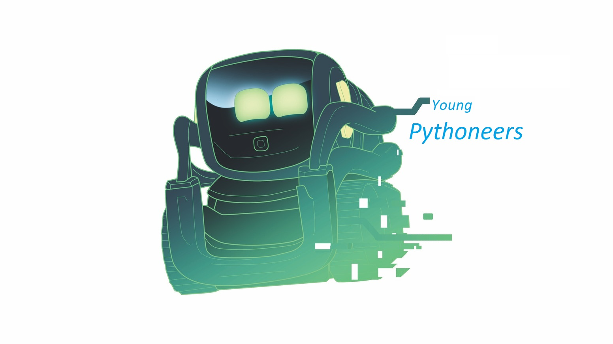
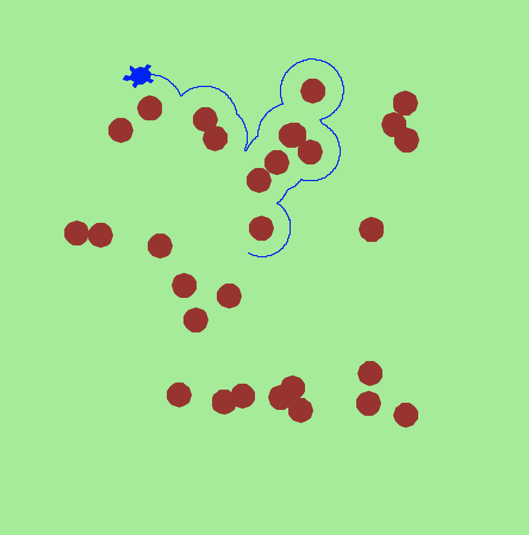

# Young Pythoneers
### A Pythonic Project-based Curriculum
#### to develop Creative, Problem-Solving skills in Youngsters

---
##### Admission subject to an initial screening interview
---

## Contact
[Mohammed Terry-Jack](https://www.linkedin.com/in/dery-terry/)

`(Professional AI Developer | PhD at University of York)`

[email](mohammedterryjack@gmail.com) | [blog](https://medium.com/@b.terryjack)

---
## Requirements 
##### (with Strongly Recommended versions)
### Software
* [Python 3](https://www.python.org/download/releases/3.0/)
* [Visual Studio Code](https://code.visualstudio.com/) (or any other IDE)
### Hardware
* A Computer or Laptop (with access to the internet)
* [BBC Microbit (version 2.0)](https://www.amazon.co.uk/BBC-micro-Pocket-Sized-Programmable-Computer/dp/B08TR1QMR1/ref=sr_1_4?dchild=1&keywords=microbit+v2&qid=1615166120&sr=8-4)
* [Anki's Robot "Vector"](https://www.amazon.co.uk/Vector-Robot-Anki-Controlled-Built/dp/B078T42JCM/ref=sr_1_1?dchild=1&keywords=anki+vector&qid=1615166151&sr=8-1)
--- 
## Curriculum
* Phase 1: Virtual Robotics with [Turtle](https://docs.python.org/3/library/turtle.html)
* Phase 2: Building a pokemon-style game in [Pygame](https://www.pygame.org/docs/)
* Phase 3: Various projects with [Microbit](https://microbit-micropython.readthedocs.io/en/v1.0.1/)
* Phase 4: Various projects with an actual robot called [Vector](https://www.digitaldreamlabs.com/collections/vector-products)

---

### Phase 1: Virtual Robotics with Turtle

* Lesson 1: Turtle Art
* Lesson 2: Adding Keyboard controls to the Turtle
* Lesson 3: Adding a shootable cannon to the Turtle
* Lesson 4: Adding a second turtle and destructability
* Lesson 5: Adding Indestructable, uncrossable Walls and making mazes
* Lesson 6: Loadable Mazes & Playing the 2 Player Tank Game
* Lesson 7 (bonus): Adding AI to the Enemy Tank

---

### Phase 2: Building a pokemon-style game in Pygame

* Sprites
* Keyboard control
* Music
* Scenery
* Interacting with scenery and characters
* (bonus) AI characters and talking behaviours

---

### Phase 3: Various projects with Microbit 

* A Mini tank game using the LED display
* ...adding tilt controls
* ..adding sound effects
* Remote control usint tilt controls and bluetooth
* Remote control using speech to text using the microphone
* Text to Speech using the speaker
* A Simple Chatbot
* TODO: Snake
* TODO: Other sensors

---

### Phase 4: Various projects with an actual robot called Vector
* Introduction to ["Vector"](https://developer.anki.com/)
* [Python's SDK](https://developer.anki.com/vector/docs/index.html) to "rewire" Vector's brains
* Using Vector's Legs to move and Arms to move other things

* Using Vector's Display

* Using Vector's Voice Commands and Camera

* Using Vector's IR laser and Ground sensors

* TODO: Other Sensors
