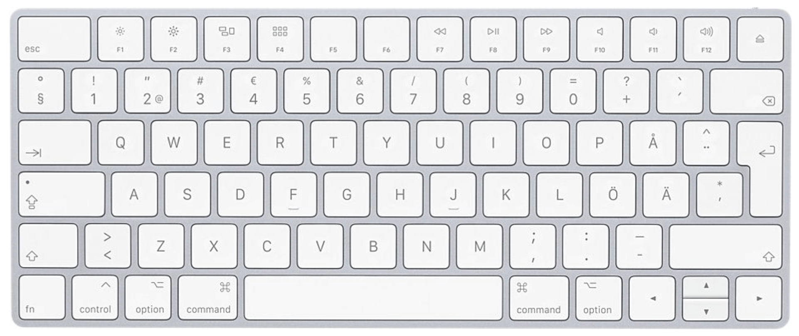

# (optional) Phase 0: Communicating with my Computer
## Lesson 1: Write and Say Hello World
---
### Theoretical Coding Principals (`Python-related Syntax`)
* using shortcut keys on the keyboard
* writing their first python program
* execute their program in terminal
* debugging runtime errors
* importing from libraries (e.g. `import` and `from`)
* in-build functions (e.g. `print()`)
* imported functions (e.g. `say()`)
---
### Practical Project-related Deliverables
* target 1: display a message
* target 2: make the computer read your message aloud
---
### Example Screenshots

