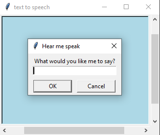

# (optional) Phase 0: Communicating with my Computer
## (optional) Lesson 2: Graphical User Interface
---
### Theoretical Coding Principals (`Python-related Syntax`)
* Screen related functions (e.g. `.bgcolor()`, `.textinput()`)
* loops (`while`)
* conditionals (`if`)
---
### Practical Project-related Deliverables
* target 1: create a simple GUI to hear your message read aloud
* target 2: make the GUI take in text and repeat
---
### Example Screenshots
