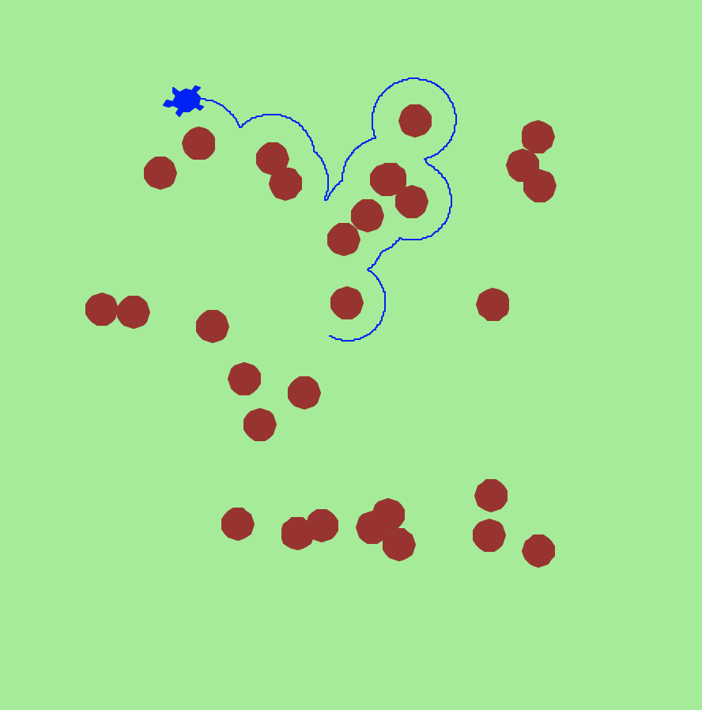

# Phase 1: Virtual Robotics with [Turtle](https://docs.python.org/3/library/turtle.html)

---
## Requirements 
##### (with Strongly Recommended versions)
### Software
* [Python 3](https://www.python.org/download/releases/3.0/) or [Pydroid3](https://play.google.com/store/apps/details?id=ru.iiec.pydroid3&hl=en_GB&gl=US) (if using an android device)
* (optional) [Visual Studio Code](https://code.visualstudio.com/) (or any other IDE)
### Hardware
* A Computer/Laptop or Phone/Tablet (running Android)
--- 

## Lessons
* [Lesson 1: Turtle Art](lesson_1/README.md)
* [Lesson 2: Customising the Shape and adding Keyboard controls to the Turtle](lesson_2/README.md)
* [Lesson 3: Adding a shootable cannon](lesson_3/README.md)
* [Lesson 4: A second Turtle Heat-seeking missile. Turtle destructability and indestructable, uncrossable Walls](lesson_4/README.md)
* [Lesson 5: Loading in mazes and playing 2 player tank game](lesson_5/README.md)
* [Lesson 6 (bonus): Adding AI to the Enemy Tank](lesson_6/README.md)