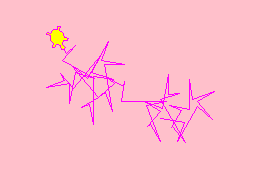

# Phase 1: Virtual Robotics with [Turtle](https://docs.python.org/3/library/turtle.html)
## Lesson 1: Turtle Art
---
### Practical Coding Skills 
* writing their first python program
* execute their program in terminal
* debugging runtime errors
---
### Theoretical Coding Principals (`Python-related Syntax`)
* importing from libraries (e.g. `import` and `from`)
* in-build functions (e.g. `print()`)
* imported functions (e.g. `randint()`)
* class-specific functions (e.g. `turtle.forward()`)
* iterating (e.g. `for` and `while`) 
---
### Project-related Deliverables
* target 1: display hello world
* target 2: display the turtle world
* target 3: customise the background colour
* target 4: move the turtle to draw shapes
* target 5: use iteration to draw complex patterns
* target 6 (bonus): add stochasticity into patterns
---
### Example Screenshots

