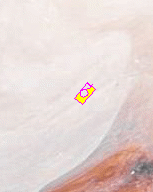

# Phase 1: Virtual Robotics with [Turtle](https://docs.python.org/3/library/turtle.html)
## Lesson 2: Customising the Shape and adding Keyboard controls to the Turtle
---
### Theoretical Coding Principals (`Python-related Syntax`)
* defining custom functions (e.g. `def ninja_star():`)
* calling custom functions (e.g. `ninja_star()`)
* calling class-specific functions (e.g. `screen.onkeypress()` or `screen.listen()`)
* importing and calling custom-built helper functions (e.g `from utils import set_custom_shape`)
---
### Practical Project-related Deliverables
* target 1: create your first function (which draws a custom shape)
* target 2: set the turtle to that custom shape
* target 3: add keyboard events to control the turtle
* target 4: create a keyboard-controlled tank

---
### Example Screenshots

