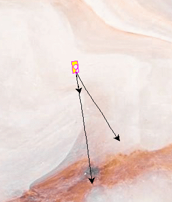

# Phase 1: Virtual Robotics with [Turtle](https://docs.python.org/3/library/turtle.html)
## Lesson 3: Adding a shootable cannon
---
### Theoretical Coding Principals (`Python-related Syntax`)
* defining custom classes (e.g. `class Tank(Turtle):`)
* defining custom class functions (e.g. `def shoot(self)`)
* assigning default values to a function's input variables (e.g. `def shoot(rocket_speed:int=3):`)
---
### Practical Project-related Deliverables
* target 1: create a class called Tank 
* target 2: add a function so your tank can shoot a misile
* target 3: allow the misile to be affected by wind
* target 4: add keyboard controls to fire the missile
### Example Screenshots
