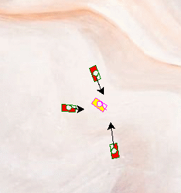

# Phase 1: Virtual Robotics with [Turtle](https://docs.python.org/3/library/turtle.html)
## Lesson 4: Enemy tanks with AI
---
### Theoretical Coding Principals (`Python-related Syntax`)
* importing and calling functions (e.g. `ontimer()`)
* calling inbuilt class functions (e.g. `.setheading()`, `.distance()`, `.towards()`)
* adding default input values to custom functions (e.g. `def drive_to_target(speed:int=3)`)
* conditionals (e.g. `if` and `else`)
---
### Practical Project-related Deliverables
* target 1: add a custom function into your Tank class to make it move toward a target on its own
* target 2: add a conditional to your function to let the tank shoot the target when close enough
* target 3: create multiple enemy tanks (to see the power of classes)
---
### Example Screenshots

