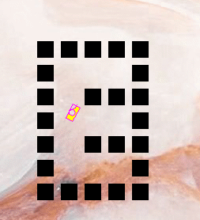
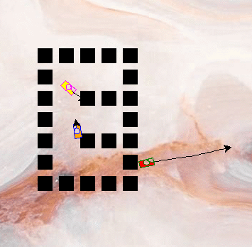

# Phase 1: Virtual Robotics with [Turtle](https://docs.python.org/3/library/turtle.html)
## Lesson 5: Loading in Walls and Multiple Players
---
### Theoretical Coding Principals (`Python-related Syntax`)
* Reading in files (`with open() as x:`)
---
### Practical Project-related Deliverables
* Place turtles as walls
* Read in walls from a file
* Create a second controllable player
---
### Example Screenshots

